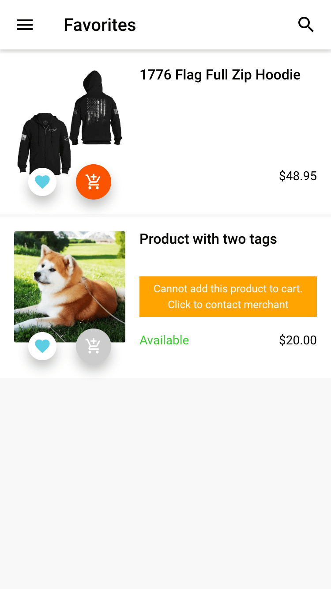
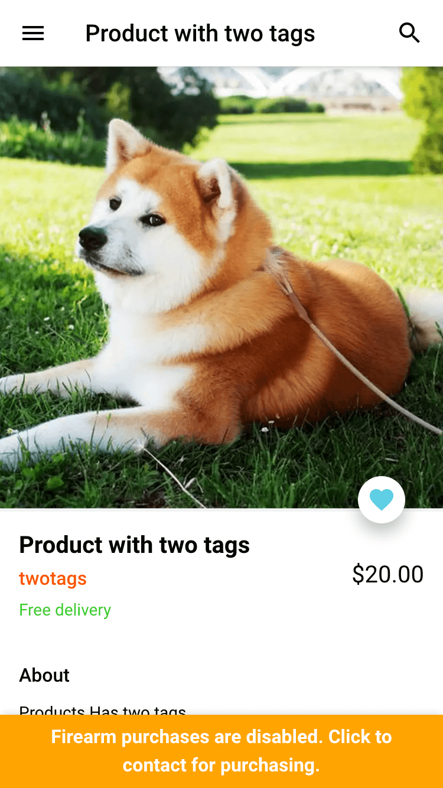
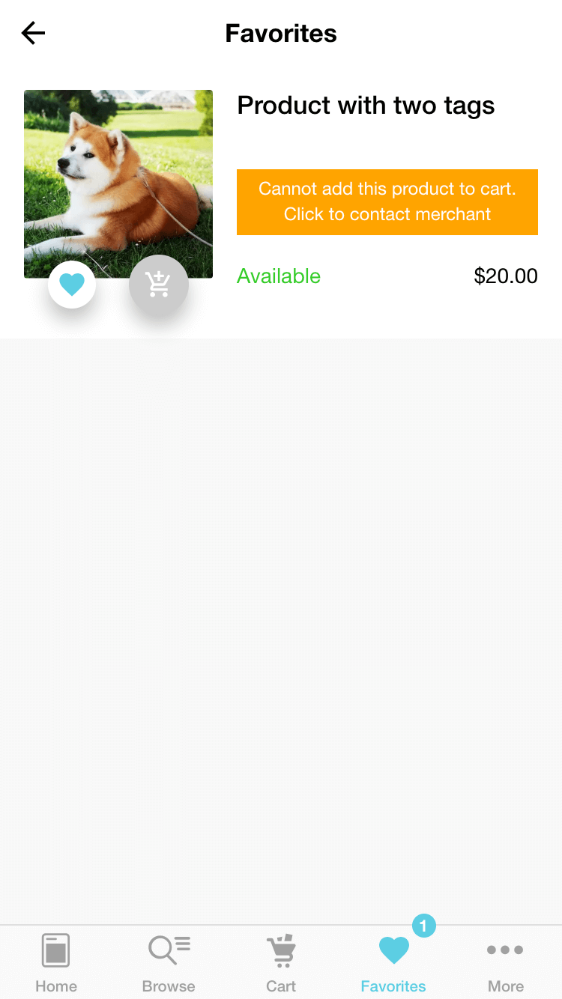
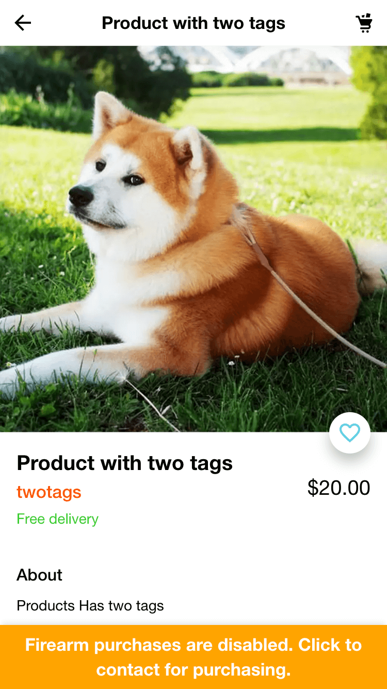

# Demo

## Redirect Non-app Item Purchase configurations
Redirect Non-app Item Purchase configuration is set up in the connect admin. All configurations are required
Example configuration for the following images:

#### Merchant Admin Config:
```json
{
  "triggerTags": ["is-firearm", "is-knife"],
  "triggerProperties": [{"label": "type", "value": "firearm"}],
  "barText": "Firearm purchases are disabled. Click to contact for purchasing.",
  "barColor": "orange",
  "barFontColor": "white",
  "contactNumber": "123-456-7890",
  "favoritesNotice": "Cannot add this product to cart. Click to contact merchant"
}
```

#### GMD Examples:



#### iOS Examples:


